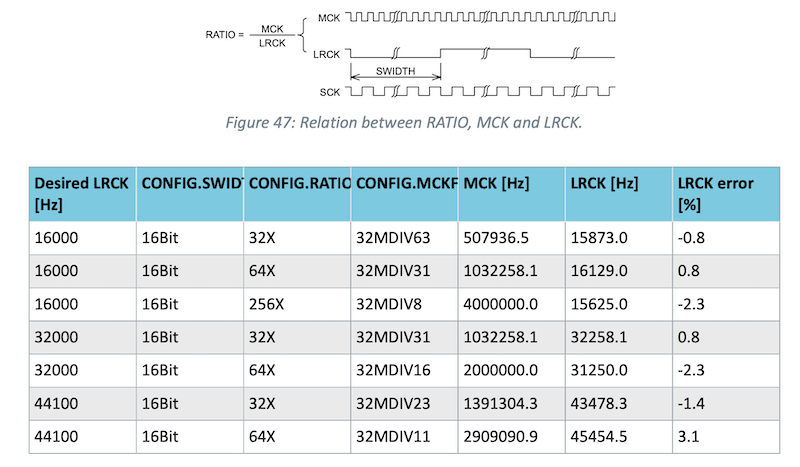

# JSN-SR04_Gen3_RK

*Library for JSN-SR04 ultrasonic distance sensor for Particle Gen 3 devices (Argon, Boron, B Series SoM, Tracker)*

The JSN-SR04 is an inexpensive ultrasonic distance sensor. There are many manufacturers, some are weather resistant, and they have somewhat different supported ranges, but usually in the range of a few centimeters to maybe a few meters. Also note: these sensors are generally not all that reliable. I would not use one in a life-safety situation and be sure to code defensively for the case when it fails.

Once characteristic of the sensor is that you need to measure the pulse width to within a microsecond or so, and measurement takes around 150 µs of setup time and up to 29 milliseconds of pulse width (at 5 meters). At a more reasonable 1 meter, it's still around 6 milliseconds.

The problem on Gen 3 devices (nRF52840) is that even if you use interrupts, the interrupt latency is very high, and extremely variable. The radio stack runs at a high interrupt priority and will delay other interrupts until completion. Because of the long time to sample, you don't want to disable interrupts because it will adversely affect the BLE radio, and the reset of the system. But if you do not disable interrupts, the interrupt latency makes for very inaccurate readings.

The solution is the technique used in this library: The nRF52840 I2S, note this is I2S, as in sound, not I2C, peripheral is really just a high-speed digital input and output device with hardware DMA. The library is configured to use 32,000 samples per second, with 16 bits per sample, stereo. This works out to a bit clock of 1 MHz, or 1 µs per sample bit, which is perfect for the JSN-SR04.

The library uses the I2S peripheral to both generate the TRIG pulse and measure the resulting ECHO pulse. It does so without ever disabling interrupts, and the interrupt occurs after the entire maximum measurement is complete. A deferred interrupt does not affect the accuracy of the sensor!


### Level shifter required!

One caveat is the the JSN-SR04 sensors generally require 5V to operate properly.

Particle Gen 3 devices are not 5V tolerant because the nRF52840 MCU is not! Be sure to use a level shifter on the ECHO output from the JSN-SR04 to the GPIO on the Particle device, or you will likely permanently damage the pin on the Particle device.

Also note that since you need 5V you will not be able to power the sensor off the LiPo battery unless you use an external boost converter. If you are powered by USB, you can power the sensor from the VUSB bin.

### Lots of GPIO required

One caveat is that this library requires a lot of GPIO: 4 GPIO.

Of course there are the two standard JSN-SR04 pins, TRIG (output) and ECHO (input).

The unfortunate thing is that you also need to dedicate two other pins, unusedPin1 and unusedPin2. These must not be the same pin, and can't be used for anything else for all practical purposes. This is due to how the I2S peripheral works. You have to assign the I2S LRCK and SCK to pins or the nRF52 I2S peripheral won't initialize. You won't need these outputs for anything, but they do need to be assigned GPIOs. The signals happen to be 32 kHz for the LRCK and 1 MHz for SCK while getting a distance sample. 

### Memory requirements

The DMA buffers require 2,144 of RAM at the default maximum measurement of 2 meters.

## Modes of operation

The library essentially only works with one sensor. You could reinitialize it on different pins for multiple sensors, but you can't measure more than one sensor at the same time because the I2S peripheral has a single bit digital capture.

### Periodic with callback

The recommended mode of operation is to assign a callback function, and set the sensor to periodically sample. The minimum period is 30 milliseconds, but you should probably not set it below 50 milliseconds. It can be far longer if desired.

The callback is called with a DistanceResult object that contains the distance which you can retrieve in meters, centimeters, or inches. It will also include a status code, such as SUCCESS, RANGE_ERROR (too close or too far), or other errors.

### Single shot with callback

If you only need a single sample, you can do that as well.

### Single shot synchronous

This is not recommended, because it will block the current thread for 


## Calculations

The TRIG pin is normally low, you pulse it high for 10 µS to begin measurement.

The ECHO pin is normally low, it will go high during the measurement, and the length of the high pulse determines the distance:

Distance = (T × C) / 2

where:

- T is the time of the pulse in seconds  
- C is the speed of sound (340 meters/sec)

The detection range of the sensor I got is 2 cm (0.02 m) to 500 cm (5 m). This means the time of the pulse ranges from:

- Min: 0.02 m = 0.00011765 sec = 0.1176 ms = 117 µs
- Max: 5 m = 0.0294 sec = 29 ms


The accuracy of the sensor I got is claimed to be 0.3 cm, or 0.0003 meters. 

- 0.0003 meters = 0.00000186 sec = 0.00176 milliseconds = 1.76 microseconds
- 568,181 Hz

We really want to sample at roughly twice that frequency, if possible, or even higher.

The I2S peripheral has many possible configurations:



Note that the sample rate (LRCK), is the number of 16-bit stereo samples. Each bit of our input is one of those bits, so a sample rate of 32000 Hz is actually samples at 1,024,000 Hz, which is close to our target. Perfect!

In other words, with a 1 MHz sample rate, we can measure the width of a pulse with a resolution if 1 µs (1 microsecond), without touching interrupts and with no interrupt latency, because the I2S peripheral does not require bit-level interrupts. 

The total buffer length is the length of the TRIG pulse (10 µS) + setup time + maximum detection pulse (29 ms). 

The TRIG pulse output should be 10 µs. This is a minimum of 10 bits of output 1. We use 16 bits because it's really convenient with 16-bit samples.

The setup time is not in the datasheet, but dumping the ECHO pin output from the sensor looks like this:

```
0000005026 [app] INFO: 0090: 0000 0000 0000 0000
0000005026 [app] INFO: 0094: 03ff ffff ffff ffff
0000005027 [app] INFO: 0098: ffff ffff ffff ffff
0000005027 [app] INFO: 009c: ffff ffff ffff ffff
0000005028 [app] INFO: 00a0: ffff ffff ffff ffff
0000005028 [app] INFO: 00a4: ffff ffff ffff ffff
0000005029 [app] INFO: 00a8: ffff ffff ffff ffff
0000005029 [app] INFO: 00ac: ffff ffff ffff ffff
0000005030 [app] INFO: 00b0: ffff ffff ffff ffff
0000005030 [app] INFO: 00b4: ffff ffff ffff ffff
0000005031 [app] INFO: 00b8: ffff ffff fffe 0000
0000005031 [app] INFO: 00bc: 0000 0000 0000 0000
0000005032 [app] INFO: 00c0: 0000 0000 0000 0000
```

- The time from the falling TRIG pulse to ECHO going high is 0x93 16-bit samples (147), or 2.35 ms.

- In other words, the leading overhead should be assumed to be around 150 16-bit samples.

- When the signal goes high the sample has a value of 0x03ff. The leftmost (MSB) is the first, chronologically.

- When the signal goes low the sample has a value of 0xfff3. The rightmost (LSB) is the last, chronologically.

I set the leadingOverhead to 152 16-bit samples, or 2432 µs.

Even though this sensor is theoretically able to measure up to 5 meters, I've never had a sensor work at that distance reliably. To save RAM, I set the maximum distance to 1 meters. You could set it shorter or a longer if desired.

- D = 1 meters
- C = 340 meters/sec
- T = (2 × D) / C
- T = 0.005882 sec = 5.882 ms = 5882 µs = 5,882 1-bit samples = 368 16-bit samples

Adding in the 152 16-bit sample time results in 520 16-bit samples. This is 1,040 bytes, however we need both transmit and receive DMA buffers, so that's a total overhead of 2,080 bytes for transmit and receive buffers at 1 meter.

If you wanted a 2 meter range and had a sensor that worked acceptable at that range, it would require 4,160 bytes of buffer, and so on. The maximum range is a floating point number, so you could do 1.5 meter or 3,120 bytes.

At a maximum distance of 5 meters, T = (2 × D) / C = 0.294 seconds = 294 milliseconds. This is where the 300 millisecond safety timer is derived from. If the sensor fails to respond in this amount of time, something has gone wrong.

The datasheet is silent as to what happens if you pulse TRIG high while ECHO is still high. The library returns a BUSY error if you attempt this since the behavior in unspecified.

The getSampleTimeMs() method returns the number of milliseconds it takes to process a sample. In practice it might take a few milliseconds longer because of the delays in dispatching loop().

The formula is:

- T = (2 × D) / C
- leadingOverheadMs = leadingOverhead * 16 / 1000 = 152 * 16 / 1000 = 2.432 ms
- Cms = 0.340 meters/millisecond
- Tms = (2 × D) / Cms + leadingOverheadMs

For the default of D = 1 meter:

- D = 1 meter
- Tms = (2 × D) / Cms + leadingOverheadMs
- Tms = 2 / 0.340 + 2.432
- Tms = 8.31 ms (rounded up to 9)

Thus in theory you could sample at around every 9 milliseconds, maybe 10, but it's probably best to limit it to 100 milliseconds, or even 500 milliseconds, to be safe. If you sample frequently, be sure to handle the case where BUSY status is returned. This means that that sensor has not yet reset the ECHO output low and a sample cannot be taken yet.
